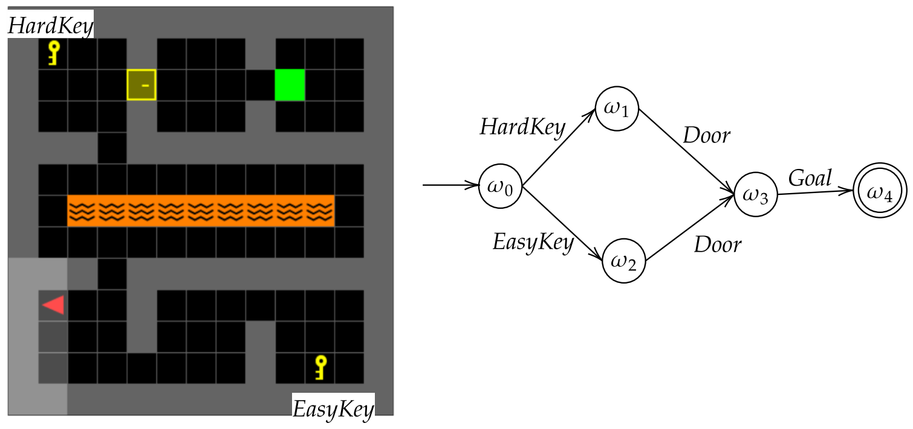

# minigrid-updated
Updated minigrid

Minigrid path: {miniconda3}/envs/{Name of env}/lib/{python version}/site-packages/minigrid


<div align='center'>
  Environment and its corresponding task automaton
  
</div>

Environmets:

```MiniGrid-NineRoomsEasyKey-v0``` - Get the EasyKey 

```MiniGrid-NineRoomsHardKey-v0```' - Get the HardKey

```MiniGrid-NineRoomsEasyKeyGoal-v0``` - Start with the EasyKey in inventory, and reach the goal. Agent start state is the room EasyKey is in.

```MiniGrid-NineRoomsHardKeyGoal-v0``` - Start with the HardKey in inventory, and reach the goal. Agent start state is the room HardKey is in.

```MiniGrid-NineRoomsKeyEasyDoor-v0``` - Start with the EasyKey in inventory, and open the door. Agent start state is the room EasyKey is in.

```MiniGrid-NineRoomsKeyHardDoor-v0``` - Start with the HardKey in inventory, and open the door. Agent start state is the room HardKey is in.

```MiniGrid-NineRoomsDoorGoal-v0``` - Start with the door opened, and reach the goal. Agent start state is to the right of the door.

```MiniGrid-NineRoomsKeyGoal-v0``` - Entire task. Get any key, open the door, and reach the goal.
